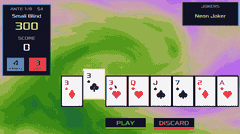
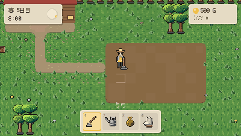
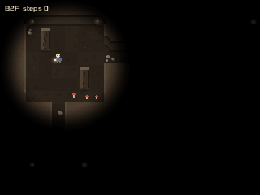
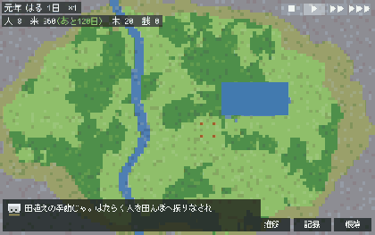
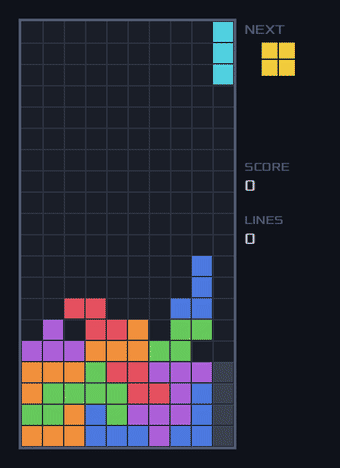
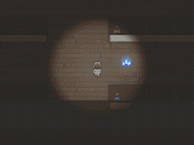
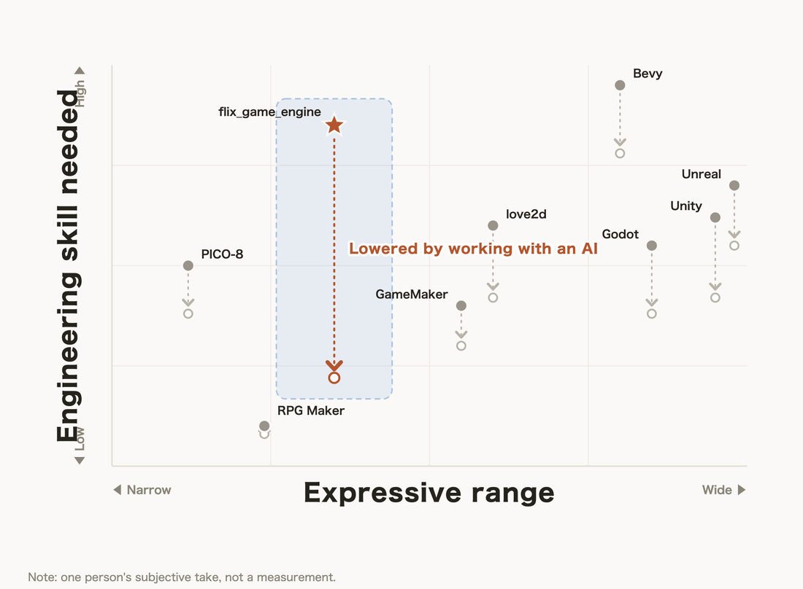
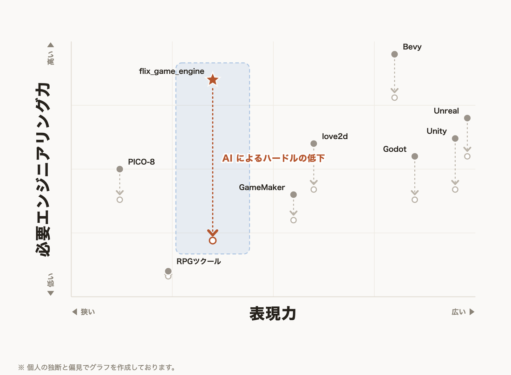

<p align="center">
  
</p>

# Flix Game Engine

A 2D game engine written in [Flix](https://flix.dev/), built to be worked on
**together with an AI**. It narrows its scope to 2D so that the things games
usually need can ship as official parts rather than plugins, and it is wired so
an AI can check its own work instead of asking you to look.

**[flix_ge_studio](https://github.com/ababup1192/flix_ge_studio)** is the companion
editor: pick a genre, generate a game, and tune its values through forms and sliders
while it runs.

| | | |
|:--:|:--:|:--:|
|  |  |  |
| Card game | Farm sim | Dungeon crawler |
|  |  |  |
| Visual novel | Village sim | Falling-block puzzle |
|  | | |
| Horror exploration | | |

Development here is genre-free. The parts are plentiful and pitched at a high
enough level that **any 2D game can be expressed** by combining them.

Most of these were made **without a single hand-drawn or bought asset** — the
engine can have an AI produce the minimum art and sound it needs.

## Why this engine is easy to build with an AI

The AI can check its own work, and you can hand it the situation without
describing it. Game rules are pure functions, so they can be pulled out and
exercised on their own — after a change the AI verifies itself. The look is
guaranteed **pixel for pixel** by comparing baked frames, so a fix that quietly
breaks something else shows up immediately. And when a game misbehaves, the whole
state can be handed over as data, so you never have to put the symptom into words.

That last part is what makes the difference. Every engine gets easier once an AI
writes the code; here the AI's output can be *checked by machine*, so far more of
the work can be handed over.

<p align="center">
  <picture>
    <source media="(prefers-color-scheme: dark)" srcset="docs/brand/positioning-dark-en.png">
    
  </picture>
</p>

## What is already built in

Everything below is an official part of the engine, so neither you nor an AI has
to build it from scratch. Full index: [docs/module-index.md](docs/module-index.md).

- **Light and shadow** — reflections on mirrors and water, light sources, cast
  shadows, a whole-screen colour filter (time of day), sprite shading, additive /
  multiply blending, glow
- **Motion and effects** — particles, procedural shader surfaces (no raw GLSL),
  object sway, screen transitions, sprite rotation, tweening, sprite animation,
  scripted action sequences, path following, cutscenes, BGM fades
- **Game systems** — save/load, rewind & replay, per-tile state, pathfinding and
  movement range, enemy AI, hitboxes declared in JSON, collision and physics, timers
- **UI** — dialogue windows with typewriter text, menus, scrolling lists, UI
  declared in JSON (one declaration drives both the look and the click target),
  9-slice window frames, variables embedded in text, mouse picking
- **Boards and terrain** — dual-grid terrain that needs no tile art, maps written
  as a character grid, tileset images with auto-tiling, sprites as character grids,
  automatic depth sorting, view culling, infinite scatter
- **Input and camera** — key mapping, edge detection, mouse wheel, camera
  follow/zoom, camera shake, pixel-perfect rendering
- **While you work** — tune numbers without restarting, machine-verified visual
  regressions, drive the game over HTTP from an AI or external tool, pause and
  circle a spot to report it

Games are built around a single immutable `World` value: systems are pure
functions run each frame by a Bevy-style `App`, and every frame is rendered from
the `World`. Rendering, input, and audio are a from-scratch implementation on top
of LWJGL (OpenGL 3.3 Core / GLFW / OpenAL). The engine ships as a reusable
library, with real games living under `examples/`, in a monorepo layout. The
recommended one is **fe_rogue** (a Fire Emblem-style SRPG + roguelike).

> 日本語版は[下](#flix-game-engine-日本語)にあります。

## Requirements

- **devbox** (required — fetches JDK 21, GNU make, and the Flix 0.75.1 compiler automatically)
- Supported OS: macOS (Apple Silicon / Intel) / Windows x86_64

The Flix **0.75.1** compiler is provided via [Cj-bc/flix.nix](https://github.com/Cj-bc/flix.nix)
(pinned in `devbox.json`), so no manual jar download is needed. The `bin/flix` wrapper runs that
jar with devbox's JDK 21 (adding `-XstartOnFirstThread` / headless flags as needed).

## Setup

Set up the toolchain and build the engine packages:

```bash
devbox shell        # fetch JDK 21 + make + Flix compiler, and add bin/ to PATH
make sync            # build-pkg all engine packages and distribute (via symlink) to examples & ide
```

Run `make sync` **once on first setup**. Each example resolves the engine through
a relative symlink under `lib/github/ababup1192/.../0.1.0/`, so without it the
dependency cannot be resolved. After editing an engine package, re-run `make sync`
(or the per-package `sync-*` targets; note that `engine_world` / `engine_tools`
build on `engine`, so re-sync them too after editing `engine`).

```bash
make help            # list other targets (sync-engine, etc.)
```

## Recommended game: play fe_rogue

A Fire Emblem-style turn-based strategy RPG (SRPG) with roguelike elements.

- Progress through dungeon floors (move between floors via stairs)
- Player turn → enemy turn cycle, with enemy AI acting automatically
- Equip/use units, weapons, and staves (magic); battle forecast (hit rate / predicted damage)
- Experience and level-ups, consumable items such as potions

### Run

```bash
devbox shell
make sync                 # first time only
cd examples/fe_rogue
flix run                  # bin/flix wrapper (adds -XstartOnFirstThread automatically on macOS)
```

### Controls

| Action | Keyboard | Gamepad (Xbox layout) |
|---|---|---|
| Move cursor | Arrow keys | D-pad / left stick |
| Confirm (move / attack / menu select) | Z | A |
| Menu confirm | Enter | Start |
| Cancel / back | X | B |
| Minimap | M | Y |
| Toggle danger range | Shift | LB |

> Esc is intentionally unmapped, since it triggers quitting the game on the map.

### Packaging for distribution

See [`examples/fe_rogue/DISTRIBUTION.md`](examples/fe_rogue/DISTRIBUTION.md) for
building a JRE-bundled `.dmg` / `.exe` or a jar + launcher.

## Other examples

| Game | Description |
|---|---|
| **breakout** | Breakout clone — the value-based entry tutorial (start here; see its README) |
| **sokoban** | Sokoban with unlimited undo (Worldline) — has a full build-it-yourself TUTORIAL (EN/JA) |
| **fe_rogue** | Fire Emblem-style turn-based SRPG + roguelike (recommended) |
| **liars_room** | Liar logic puzzle — every stage is machine-proven solvable (Datalog) |

Every example runs and tests the same way:

```bash
cd examples/<name>
flix run             # launch
flix test            # test
```

## Game data (Docs)

A game's numbers, look, and layout live outside the code in JSON files called
**Docs** (`<name>.<kind>.json` — e.g. `grass.theme.json`, `b1.dungeon.json`).
Behavior — rules, collision, spawning — stays in code; only values and looks go
into Docs. Every Doc kind ships a `<kind>.schema.json`, so the same schema drives
the editor form, startup validation, and AI-written data. A game can watch its
Docs with `App.watchFile`, so saving a Doc shows up in the running game right away.

Docs are edited by hand, or through forms/sliders in **flix_ge_studio** (a
separate Elm + Tauri editor). See [docs/doc-conventions.md](docs/doc-conventions.md)
for the full convention, and the "エディタと Doc の流儀" section in
[CLAUDE.md](CLAUDE.md).

Maps can be drawn without any tile art: a `*.terrain.json` Doc maps cell
characters to a material, and **painting the `rows` character grid is enough** —
the dual-grid renderer (`Terrain` / `TerrainDoc`) auto-generates the corner shapes
(round / square / diamond) from how the four corners are filled. See
`templates/rpg-starter`.

## Project layout (monorepo)

```
engine/        contract layer (GL-free, no native deps): the GameEngine.Game/Audio effect contract, shared render types, foundational types (math, color, text layout, project loading), scene-graph draw vocabulary
render_gl/     OpenGL/OpenAL backend implementing engine's contract: LWJGL window/input/audio, shaders, textures, SDF fonts (depends on engine)
engine_world/  value-based game framework: Bevy-style App run-loop, ECS queries, physics, UI widgets, camera rig, Worldline undo/replay, and frontend services (asset loading, save data, JSON, logging) (depends on engine)
engine_tools/  dev & test tooling: headless software rasterizer, filmstrip/GIF baking, reference viewer, render lint, SFX synth (depends on engine)
examples/      individual games (depend on engine, render_gl, engine_world, engine_tools)
bin/           the flix wrapper script (the compiler jar comes from devbox/nix)
flix.toml
src/           root project for the Flix community build: per-file symlinks bundling
               all engine packages into one source tree (regenerate with make sync-root-src)
```

Dependency chain: `engine` is the foundation (no deps); `render_gl`, `engine_world`, and
`engine_tools` each depend on it; `examples` depend on all four.
`make sync` runs `build-pkg` on each package and distributes it to dependents via
relative symlinks (symlink, not cp — so rebuilding the engine is reflected instantly).

## Development tips

```bash
make sync-engine         # build-pkg & distribute engine only
make sync-render-gl      # build-pkg & distribute render_gl only
make sync-engine-world   # build-pkg & distribute engine_world only
make sync-engine-tools   # build-pkg & distribute engine_tools only
make sync-root-src       # regenerate the root src/ symlinks for the Flix community build
make clean-locks         # remove stale *.lock left in the Maven cache by an interrupted flix check
make clean-example-builds # delete examples/*/build/ (speeds up IDE scene loading)
make boot-font           # re-bake the built-in splash font & logo into engine sources
make clean-font-cache    # drop the cached font atlases (next launch re-bakes them)
```

## Startup screen

Every game shows a splash screen while assets load — the engine draws it, games write
nothing. The window clears to the splash colour as soon as the GL context exists, then a
logo, a white progress bar and a one-line status (`loading images...`, `loading font ui...`,
`loading sounds...`) stay on screen until the first game frame.

The text uses a **built-in font** embedded in the engine sources (ASCII only, 1-bit
bitmap) — the game's own fonts are still being baked at that point, so they cannot be used.
The same font backs the `DEBUG=1` fps badge, so it works whatever the game names its fonts.

**Glyphs are baked the first time they are drawn, not at startup.** A CJK font holds thousands
to tens of thousands of glyphs and each one costs about a millisecond to turn into a distance
field, so baking the lot stalls startup for tens of seconds. Instead the engine starts with an
empty atlas: when a character is about to be drawn and is not there yet, it is baked into the
atlas's free space and only that patch is uploaded. The character appears one frame later.
Startup becomes instant and nothing ever silently disappears.

The trade is a small hitch on the first screen that shows a lot of new text (a few dozen
glyphs is one or two frames). `"glyphs": "used"` avoids it by scanning the project's sources
and assets at launch (a few tens of milliseconds) and baking those characters up front.

`"glyphs"` in `project.json` picks what to bake up front:

| Value | Meaning |
|---|---|
| `"auto"` (default) | nothing up front — every glyph is baked the first time it is drawn |
| `"used"` | characters found in the project's sources and assets, baked before the first frame |
| `"all"` | every glyph the font has (slow; rarely what you want) |

`FLIX_GE_GLYPHS=used\|all\|auto` overrides it for a single run, so you can compare without
editing the project.

Baked atlases are also cached under `~/.cache/flix_game_engine/font`, so later launches skip
baking entirely. A damaged or outdated cache is ignored and simply re-baked.

| Environment variable | Effect |
|---|---|
| `FLIX_GE_NO_SPLASH=1` | Skip the splash screen entirely |
| `FLIX_GE_NO_FONT_CACHE=1` | Never read or write the font atlas cache |
| `FLIX_GE_CACHE_DIR=<dir>` | Put the font atlas cache somewhere else |
| `FLIX_GE_SPLASH_SHOT=<file>` | Save a few PNGs of the splash screen (for eyeballing it) |

## Tech stack

- **Flix 0.75.1** — functional programming language
- **LWJGL** — OpenGL / GLFW / STB / OpenAL bindings
- **OpenGL 3.3 Core Profile** — shader-based 2D rendering
- **OpenAL** — sound effects and BGM playback

## License

[MIT License](LICENSE.md)

---

# Flix Game Engine (日本語)

[Flix](https://flix.dev/) で書く 2D ゲームエンジン。**AI と一緒に作る**ことを前提に設計している。
表現を 2D に絞ることで、足りない機能をプラグインで継ぎ足す形をやめ、ゲームでよくやることを
公式の部品として用意する。さらに、AI が自分の仕事を自分で確かめられる作りにしてある。

対になるエディタが **[flix_ge_studio](https://github.com/ababup1192/flix_ge_studio)**。
ジャンルを選んでゲームを作り、走らせたままフォームやスライダーで値を調整できる。

| | | |
|:--:|:--:|:--:|
|  |  |  |
| カードゲーム | 農場シミュレーション | ダンジョン探索 |
|  |  |  |
| ノベル | 村づくりシミュレーション | 落ちものパズル |
|  | | |
| ホラー探索 | | |

ジャンルフリーにゲーム開発ができる。豊富で抽象度の高いパーツの組み合わせで、
**あらゆる 2D ゲームが表現可能**。

これらのほとんどは、**人が描いた絵も、買ってきた素材も使わずに**作ったもの。絵や音も、
最低限のものは AI に作らせる仕組みがある。

## なぜ AI と作りやすいのか

**AI が自分で答え合わせをしやすく、人も今の状態を AI に伝えやすい**作りになっているから。
ゲームのルールは、その部分だけを取り出して自動で試せるので、AI は直したあと自分で確かめられる。
見た目は**ピクセル単位で変わっていないことを機械が保証できる**ので、直したつもりが別の場所を
壊していれば、その場で分かる。思ったとおりに動かないときも、そのときのゲームの中身をまるごと
AI へ渡せるので、**症状を言葉で説明する必要がない**。

AI がコードを書けば、どのエンジンでも敷居は下がる。差が出るのは下がり幅で、ここは
**AI の書いた物を機械で検算できる**ぶん、任せられる範囲が広い。

<p align="center">
  <picture>
    <source media="(prefers-color-scheme: dark)" srcset="docs/brand/positioning-dark.png">
    
  </picture>
</p>

## 何が最初から入っているか

以下はすべてエンジンの公式部品なので、人も AI も一から組む必要がない。
全モジュールの一覧は [docs/module-index.md](docs/module-index.md)。

- **光と影** — 反射・映り込み、ライティング、影の生成、画面全体の色フィルタ（朝・夕・夜）、
  スプライトの陰影、発光と減光（加算・乗算）、グロー
- **動きと演出** — パーティクル、絵を描かずに作る動く模様（シェーダーを宣言で組む）、
  オブジェクトの揺れ、画面転換（フェード・ワイプ）、スプライトの回転、トゥイーン、
  スプライトアニメ、一連の動作の再生、経路移動、イベントシーン、BGM のフェード
- **遊びの仕組み** — セーブ・ロード、巻き戻し・リプレイ、マスごとの状態、経路探索と移動範囲、
  敵 AI、当たり判定を JSON で宣言、衝突と物理、タイマー
- **画面まわり（UI）** — 会話ウィンドウと文字送り、メニュー、スクロールする一覧、
  UI を JSON で記述（見た目とクリック判定が同じ宣言から決まる）、9 スライスの枠、
  テキストの変数表示、マウス操作
- **盤面と地形** — タイル画像の要らないデュアルグリッド地形、文字で書くマップ、
  タイルセット画像（自動タイル選択）、文字の格子で描くスプライト、前後関係の自動決定、
  画面外の間引き、無限に広がる配置
- **操作とカメラ** — キーマッピング、押した瞬間の判定、マウスホイール、カメラ操作、
  画面揺れ、ピクセルパーフェクト描画
- **作っているときの道具** — 再起動せずに数値を調整、見た目の変化を機械が保証、
  AI や外部ツールから HTTP でゲームを操作、プレイ中に止めて気になる範囲を囲んで記録

ゲームは不変の `World` 値を中心に組み立てる: システムは Bevy 風 `App` が毎フレーム実行する
純粋関数で、各フレームは `World` から描画を導出する。描画・入力・音声は
LWJGL（OpenGL 3.3 Core / GLFW / OpenAL）を直接叩く自前実装。エンジンを再利用ライブラリとして
提供し、`examples/` 配下に実際のゲームが並ぶ monorepo 構成。おすすめは
**fe_rogue**（ファイアーエムブレム風 SRPG + ローグライク）。

## 必要環境

- **devbox**（必須。JDK 21 + GNU make + Flix 0.75.1 コンパイラを自動取得）
- 対応 OS: macOS（Apple Silicon / Intel）/ Windows x86_64

Flix **0.75.1** コンパイラは [Cj-bc/flix.nix](https://github.com/Cj-bc/flix.nix) 経由で提供され
（`devbox.json` に固定）、jar の手動ダウンロードは不要。`bin/flix` ラッパがその jar を
devbox の JDK 21 で実行する（必要に応じて `-XstartOnFirstThread`・headless フラグを付与）。

## セットアップ

ツールチェーンを用意し、エンジンパッケージをビルドする:

```bash
devbox shell        # JDK 21 + make + Flix コンパイラを取得し、bin/ を PATH に追加
make sync            # 全エンジンパッケージを build-pkg し、examples・ide へ symlink 配布
```

`make sync` は **初回に必ず一度実行する**。各 example はエンジンを
`lib/github/ababup1192/.../0.1.0/` への相対 symlink 経由で解決するため、これが無いと依存を解決できない。
エンジンパッケージを編集したら `make sync`（またはパッケージ別の `sync-*` ターゲット。
`engine_world` / `engine_tools` は `engine` の上に載るので、`engine` 編集後はそれらも再 sync する）で反映する。

```bash
make help            # 他ターゲット（sync-engine など）を一覧表示
```

## おすすめゲーム: fe_rogue を遊ぶ

ファイアーエムブレム風のターン制シミュレーション RPG（SRPG）＋ローグライク。

- ダンジョン階層を進行（階段でフロア移動）
- プレイヤーターン → 敵ターンのサイクル、敵 AI が自動行動
- ユニット／武器／杖（魔法）の装備・使用、戦闘予報（命中率・予想ダメージ）
- 経験値・レベルアップ、ポーション等の消費アイテム

### 実行

```bash
devbox shell
make sync                 # 初回のみ
cd examples/fe_rogue
flix run                  # bin/flix ラッパ（macOS では -XstartOnFirstThread を自動付与）
```

### 操作方法

| 操作 | キーボード | ゲームパッド（Xbox 配列） |
|---|---|---|
| カーソル移動 | 矢印キー | D-pad / 左スティック |
| 決定（移動確定・攻撃・メニュー選択） | Z | A |
| メニュー確定 | Enter | Start |
| キャンセル / 戻る | X | B |
| ミニマップ | M | Y |
| 危険範囲トグル | Shift | LB |

> Esc はマップ上でゲーム終了を誘発するため、操作には割り当てていない。

### 配布パッケージ化

JRE 同梱の `.dmg` / `.exe` や jar + ランチャの作り方は
[`examples/fe_rogue/DISTRIBUTION.md`](examples/fe_rogue/DISTRIBUTION.md) を参照。

## その他の examples

| ゲーム | 内容 |
|---|---|
| **breakout** | ブロック崩し — 値ベースの入口教材（最初に読むならこれ。README あり） |
| **sokoban** | 無制限アンドゥ（Worldline）の倉庫番 — 組み立て式 TUTORIAL 英日つき |
| **fe_rogue** | FE 風ターン制 SRPG + ローグライク（おすすめ） |
| **liars_room** | 嘘つき論理パズル — 全ステージ機械証明済み（Datalog） |

どの example も同じ手順で実行・テストできる:

```bash
cd examples/<name>
flix run             # 起動
flix test            # テスト
```

## ゲームデータ（Doc）

ゲームの数値・見た目・配置は、コードの外の JSON ファイル **Doc**
（`<名前>.<種類>.json` — 例 `grass.theme.json` / `b1.dungeon.json`）に外出しする。
振る舞い（ルール・当たり判定・生成）はコードのまま。数値と見た目だけを Doc に置く。
Doc の種類ごとに `<種類>.schema.json` があり、この 1 枚のスキーマが
エディタのフォーム生成・起動時の検証・AI がデータを書くときの仕様書を兼ねる。
ゲームが `App.watchFile` で Doc を監視すると、保存した内容が走っているゲームに即反映される。

Doc は手書きでも、**flix_ge_studio**（別リポの Elm + Tauri エディタ）の
フォーム／スライダーからでも編集できる。詳しくは
[docs/doc-conventions.md](docs/doc-conventions.md) と、[CLAUDE.md](CLAUDE.md) の
「エディタと Doc の流儀」の節を参照。

マップはチップ絵を描かずに作れる: `*.terrain.json` Doc がセル文字を質感に対応づけ、
**`rows` の文字格子を塗るだけ**でデュアルグリッド（`Terrain` / `TerrainDoc`）が
角の埋まり方から丸/四角/ひし形の形を自動生成する。見本は `templates/rpg-starter`。

## プロジェクト構成（monorepo）

```
engine/        契約層（GL 非依存・ネイティブ無し）: GameEngine.Game/Audio effect 契約・共有描画型・土台型（数学・色・テキストレイアウト・プロジェクト読み込み）・シーングラフ描画語彙
render_gl/     engine の契約を実装する OpenGL/OpenAL バックエンド: LWJGL の窓/入力/音声・シェーダ・テクスチャ・SDF フォント（engine 依存）
engine_world/  値ベースのゲームフレームワーク: Bevy 風 App ループ・ECS クエリ・物理・UI 部品・カメラリグ・Worldline undo/リプレイ・frontend サービス（アセット読み込み・セーブ・JSON・ログ）（engine 依存）
engine_tools/  開発・テスト用ツール: headless ソフトラスタライザ・コマ撮り/GIF bake・スナップショットビューア・RenderLint・効果音合成（engine 依存）
examples/      各ゲーム（engine・render_gl・engine_world・engine_tools 依存）
bin/           flix ラッパスクリプト（コンパイラ jar は devbox/nix が供給）
flix.toml
src/           Flix コミュニティビルド用のルートプロジェクト: 全エンジンパッケージを
               1 ソースツリーに束ねるファイル単位 symlink 集（make sync-root-src で再生成）
```

依存関係は `engine` が土台（依存ゼロ）で、`render_gl`・`engine_world`・`engine_tools` が
それぞれ engine に依存し、`examples` はその 4 つすべてに依存する。
`make sync` が各パッケージを `build-pkg` し、依存先へ相対 symlink で配布する
（cp ではなく symlink なので、エンジンを再ビルドすれば即座に反映される）。

## 開発 Tips

```bash
make sync-engine         # engine だけ build-pkg & 配布
make sync-render-gl      # render_gl だけ build-pkg & 配布
make sync-engine-world   # engine_world だけ build-pkg & 配布
make sync-engine-tools   # engine_tools だけ build-pkg & 配布
make sync-root-src       # コミュニティビルド用ルート src/ symlink 集を再生成
make clean-locks         # flix check 中断で残った Maven cache の *.lock を削除
make clean-example-builds # examples/*/build/ を削除（IDE のシーン読み込み高速化用）
make boot-font           # 起動画面の組み込みフォント・ロゴを engine のソースへ焼き直す
make clean-font-cache    # フォントの焼き上がりのキャッシュを捨てる（次の起動は焼き直し）
```

## 起動画面

読み込みの間、どのゲームでも起動画面が出る（エンジンが出すので、ゲーム側は何も書かない）。
GL の用意ができた時点ですぐ画面を地の色で塗り、ロゴ・白いゲージ・いま何をしているかの一行
（`loading images...` / `loading font ui...` / `loading sounds...`）を、ゲームの最初の 1 枚が
出るまで見せ続ける。

字は**エンジンのソースに埋め込んだ組み込みフォント**（ASCII だけ・1bit のドット絵）で描く。
ゲームのフォントはまさにその時焼いている最中で使えないため。`DEBUG=1` の fps 表示も同じ
フォントを使うので、ゲームがフォントに何という名前を付けていても出る。

**字は起動時ではなく、初めて出るときに焼く。** 日本語フォントは数千〜2万字を持っていて、
1 字を距離場にするのに約 1 ミリ秒かかるので、全部焼くと起動が数十秒止まる。そこでエンジンは
空のアトラスから始め、これから描く字がまだ無ければその場で焼き、アトラスの空きに置いて
**その区画だけ**を上げ直す。その字は 1 コマ遅れて現れる。起動は一瞬になり、
**字が黙って消えることもない。**

代わりに、新しい字がたくさん出る最初の画面で少し引っかかる（数十字 ＝ 1〜2 コマ）。
`"glyphs": "used"` にすると、起動時にプロジェクトのソースとアセットを走査して（数十ミリ秒）
そこにある字を先に焼くので、その引っかかりが無くなる。

起動時に何を焼くかは `project.json` の `"glyphs"` で選ぶ:

| 値 | 意味 |
|---|---|
| `"auto"`（既定） | 起動時は焼かず、出た字から順に焼く |
| `"used"` | ソースとアセットにある字を、最初の 1 コマの前に焼いておく |
| `"all"` | フォントが持つ字を全部（遅い。まず要らない） |

`FLIX_GE_GLYPHS=used\|all\|auto` でその場かぎりの上書きができる（プロジェクトを触らずに
見比べられる）。

焼いた物は `~/.cache/flix_game_engine/font` にも取っておくので、2 回目以降は焼き自体が起きない。
壊れていたり古かったりするキャッシュは黙って捨てて焼き直すので、起動が止まることはない。

| 環境変数 | 効き方 |
|---|---|
| `FLIX_GE_NO_SPLASH=1` | 起動画面を出さない |
| `FLIX_GE_NO_FONT_CACHE=1` | フォントのキャッシュを読みも書きもしない |
| `FLIX_GE_CACHE_DIR=<dir>` | フォントのキャッシュの置き場を変える |
| `FLIX_GE_SPLASH_SHOT=<file>` | 起動画面を数枚 PNG に書き出す（目視で確かめる用） |

## 技術スタック

- **Flix 0.75.1** — 関数型プログラミング言語
- **LWJGL** — OpenGL / GLFW / STB / OpenAL バインディング
- **OpenGL 3.3 Core Profile** — シェーダーベースの 2D レンダリング
- **OpenAL** — 効果音・BGM 再生

## ライセンス

[MIT License](LICENSE.md)
