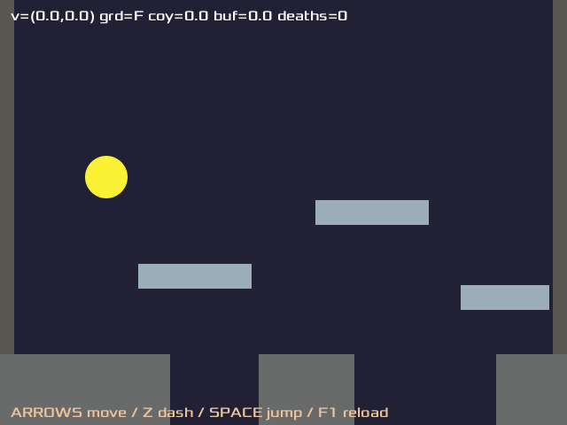

# platformer — ジャンプ手触りの検証台

エンジンがプラットフォーマーに耐えるかを最小構成で確かめる example。
背景なし・球体のプレイヤー・崖 2 本で 3 分割の地面 + 浮き床 3 枚。ジャンプの手触りは全部入り。



## 遊び方

```
make run     # 起動（make debug で F8 注釈つき）
```

←→ で走り、Space でジャンプ。**長押しで高く、すぐ離すと低く**飛ぶ。
**Z（か左 Shift）で B ダッシュ** — 最高速が 1.75 倍になる。
崖（穴）に落ちると死亡: 出発点へ戻され、HUD の deaths が増える。
狭い穴は走りジャンプで飛べるが、**広い穴は B ダッシュ + 低ホップで浮き床の下をくぐる**か、
浮き床の高い道を使う。

## 入っている手触り

| 要素 | 効き方 | パラメータ |
|---|---|---|
| 可変ジャンプ高 | 離した瞬間、上昇速度を 0.4 倍に削る | cutMult |
| コヨーテタイム | 崖を離れて 6/64 秒はまだ飛べる | coyoteTime |
| ジャンプバッファ | 着地の 8/64 秒前までの押下は着地時に飛ぶ | bufferTime |
| 非対称重力 | 下降 1.8 倍・頂点付近 0.5 倍（ふわり→ストン） | fallGravityMult / apexGravityMult |
| 慣性 | 空中の減速は地上の 1/12（走り勢いが残る） | airDecel / groundDecel |
| 空中制御 | 空中でも向きを変えられる（地上より弱い） | airAccel |
| B ダッシュ | 押している間、最高速 160 → 280。離しても急停止しない | dashMult |

重力は「重力加速度」でなく**頂点の高さ（96px）と頂点までの時間（24 フレーム）**で指定する
（`初速 = -2h/t`・`重力 = 2h/t²`）。「もう少し高く」「もう少しキビキビ」を直接回せる。

## チューニングの回し方

1. `make run` で起動したまま `assets/parameters.json` を編集
2. **F1** を押す → その場で手触りが変わる（14 個全部が差し替わる）
3. 決まった値は `src/Jump.flix` の既定値へ昇格する（json はあくまで一時上書き・fail-open）

画面上部の HUD に速度・接地・コヨーテ/バッファ残の生値が常時出る。

## デバッグの装備

- **F8 注釈チケット**（`make debug`）: 時間停止 + ←→で最大 5 秒巻き戻し + ドラッグで矩形注釈。
  スクショ・赤枠・annotation.json に加え、**world.json**（運動学・タイマー・パラメータ全値・
  直近の出来事ログ・矩形に掛かる床の一覧）が同梱される。
- **リモートデバッグ**: `DEBUG=1 DEBUG_HTTP_PORT=7777 bin/flix run` で HTTP の lockstep 口が開く。
  `./debug/jump_probe.sh` がジャンプ曲線の再現台本（`hold space 24` → 頂点で vy≈0 →
  `until=sfx:land` で着地の瞬間に停止）。
- **ギャラリー**（`make bake` → `gallery/index.html`）: 満タンジャンプ・短押しタップ・
  浮き床走破の GIF とコマ送りビューア。バイト決定的なので shasum 一致 = 挙動不変の証明。

## テスト

```
make test    # 32 本・数秒
```

ジャンプ曲線（頂点の高さ・24 フレーム目の頂点・落下 21f < 上昇 23f）、コヨーテ／バッファの
成立と失効、慣性と摩擦（厳密値）、B ダッシュ（280 到達と勢い持続）、崖死亡とリスポーン、
ダッシュ崖越えの成立／素の走りでの失敗（ゲート）、着地・頭ぶつけ・崖離れ、world.json の中身、
を具体値で pin。
dt = 1/64（2進小数）とタイマー既定値（1/64 の倍数）のおかげで、pin の大半は誤差なしの厳密比較。
