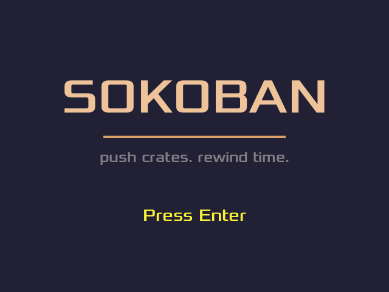

# sokoban — undo が主役の第二作

Flix で書いた倉庫番。ゲームの全状態を 1 つの「値」として持ち、**確定した手をすべて記録して
Z キーで巻き戻せる**（Worldline）。録音素材もドット絵素材もゼロ — ロボットも箱も音も紙吹雪も、
すべてコードから導出される。

初めて読むなら、まず [breakout](../breakout/)（入口教材）を。
作りながらの詳しい解説は [TUTORIAL.md](TUTORIAL.md)（英語）/ [TUTORIAL.ja.md](TUTORIAL.ja.md)（日本語）にある。



## 遊ぶ

```bash
make run
```

| キー | 操作 |
|---|---|
| ← ↑ → ↓ | 移動（押しっぱなしでマスからマスへ滑る） |
| Z | 巻き戻し（押しっぱなしで 1 手ずつ連鎖。頭上の時計が回る） |
| X | あきらめてタイトルへ戻る |
| Enter | 決定（開始・次のレベル） |
| F1 | `assets/*.ui.json` を読み直してページの見た目を変える（遊びながら編集できる） |
| Esc | 終了 — ただし CLEAR パネル表示中はパネルを閉じてタイトルへ |

その他のコマンド:

```bash
make test   # テスト（検証のみ・~7 秒。ソルバーによるレベルの機械証明つき）
make bake   # ギャラリーと効果音 WAV を生成 → gallery/index.html をブラウザで開く
make check  # 型検査だけ
```

（初回は リポジトリのルートで `make sync` を一度実行してエンジンを配布する）

## 読む順

```
Main (15行)  ── ゲームの目次。App に部品を繋ぐ宣言だけ
  ↓
Controls (42行) ── キーが「ゲームの意味」になる場所 + 終了判定（CLEAR 中の Esc の行き先）
  ↓
Level (109行) ── 標準 sokoban 記法のパーサとレベル文字列。レベルを足すならここ
  ↓
Palette (55行) ── 色のロール名。描画コードは色リテラルを書かない
  ↓
Board (156行) ── 盤面の型とグリッドのルール（動く・押す・勝つ）
  ↓
Sokoban (219行) ── ルールの中心: step（1 フレーム進める）と tick（undo 履歴込みの 1 フレーム）
  ↓
View (356行) ── Session から絵への投影。compose が盤面と UI を 1 本のリストへ
  ↓
Crate (105行) / Robot (152行) ── 箱とロボットの手続き描画（素材ゼロ）
  ↓
Sfx (11行) + GameUi (36行) ── 音への投影と、Title/Clear ページ（json 宣言）
```

後回しでよいもの: `src/bake/`（Bake・GameGallery・RobotGallery・SfxBake — 生成の道具）、
`Trace` / `Harness` / `SokobanLint`（テストとギャラリーの共有部品）。

## 1 フレームの流れ

```
キー・時計           Session（値）                        画面・スピーカー
   │                    │                                    ↑
   │ App が Frame に焼く │                                    │
   ▼                    ▼                                    │
 Frame ─Controls─▶ tick ─▶ 次の Session ─▶ projectUi ────┬▶ View.compose ─▶ 絵
                  （純粋）                 （ページを整える） └▶ Sfx.events ──▶ 音名
```

外の世界（キー読み・描画・音再生・ファイル）に触れるのは App（engine_world のランナー）だけ。
[breakout](../breakout/) との違いは 2 つ — **システムが 2 本**（tick と projectUi）であることと、
**終了判定を quitWhen で差し替えている**こと（CLEAR パネル中の Esc はゲームへ渡す）。

## undo のしくみ（本作の見せ物）

- 確定した手だけが `Worldline` に記録される（フレームごとではない）。手数 = 過去の長さ
- Z は 1 手戻して**逆向きのスライドを再生**する — ロボットは後ろ向きに滑り、頭上の時計が
  巻き戻した手の数だけ反時計回りに回る
- 歩行も巻き戻しも「絵が着地したときにだけ次の入力を受け付ける」— 受付条件は 1 つだけ
- 履歴 1 件 ≈ 172 バイト。10,000 手でも 2MB 未満: 無制限アンドゥは事実上タダ

## エンジン側の言葉（このフォルダに定義が無いもの）

| 名前 | 住所 | 何か |
|---|---|---|
| `App` / `Frame` | `engine_world/` | ランナー。キー・時計を Frame に焼き、システム（(Frame, w) -> w）を毎フレーム畳む |
| `Worldline` | `engine_world/` | Worlds のジッパー（過去・現在・未来）。record / undo / redo / pastLength |
| `Render` / `Placed` | `engine_world/` | 「(置き場所, 見せたい物)」の語彙と描画命令への変換 |
| `UiSpec` / `UiStore` / `UiRender` | `engine_world/` | json 宣言の UI ページ（spawn / reload / items 化） |
| `Replay` | `engine_world/` | 入力キュー列で tick を最後まで流す（テストと GIF の共通駆動） |
| `Fx` / `Curve` / `Quad` / `Grid` | `engine_world/` | 紙吹雪・補間・四角形・グリッド座標の純粋な計算 |
| `SfxSynth` / `SoftRaster` / `GifEncoder` / `RenderLint` | `engine_tools/` | 音の合成・画面なし描画・GIF・UI の幾何検査 |

Flix の `run { ... } with X.runWithY` は「この処理が外の世界に触れるとき、その実体を X に任せる」
という宣言（effect handler）。詳しくは [Flix 公式ドキュメント](https://doc.flix.dev/) を。

## 検証の流儀

- **数値で固定する**: `test/TestSokoban.flix`（50 本）が移動・押し・undo・時計・紙吹雪を具体値で pin
- **ソルバーで証明する**: `test/Solver.flix`（独立実装の BFS）が同梱レベルの最短押し数を機械証明し、
  連結性・角デッドロックの静的検査が出荷品質を守る
- **絵はバイトで固定する**: `make bake` の生成物（PNG/GIF/WAV）は決定的 —
  挙動を変えないリファクタは全ファイル shasum 一致で証明できる
- テストは検証だけ・生成は `make bake`（テストコードに生成を書かない）

## 練習課題

### ① レベル 3 を足す（Level と Board の 2 箇所 + ソルバーの証明）

1. `src/Level.flix` に `pub def three(): String = ...` を足す
   （`#` 壁 / `@` ロボット / `$` 箱 / `.` ゴール / `*` 箱+ゴール / `+` ロボ+ゴール）
2. `src/Board.flix` の `levelText` に `case 3 => Level.three()` を足し、`levelCount()` を `3` に
   — 足し忘れは `case _` が大声で落ちて教えてくれる
3. `make test` — `TestSolver` の流儀に倣い、自分のレベルが解けること（と最短押し数）を
   `Solver.minPushes` で機械証明するテストを 1 本足す
4. `make run` でレベル 2 クリア後に自分のレベルが出る

### ② ロボットの色を変える

`src/Palette.flix` の `robotBody` / `robotTrim` / `robotEye` を書き換えるだけ。描画コードは触らない。

### ③ 紙吹雪を盛る

`src/View.flix` の `confettiCount()`（枚数）と `src/Palette.flix` の `confetti`（色のロール）を調整。
粒子は 1 枚も保存されていない — `clearElapsed` 秒目の雨全体が毎フレーム計算で導出される、
という設計を壊さずに増やせることを確かめよう。

### ④ 音を 1 つ足す（cookbook）

例:「壁にぶつかったときのゴツン」

1. `src/Sokoban.flix` — `sfxEvent` に条件を足す（例: ロボットのセルも箱も変わらず
   facing だけ変わった → `Some("bump")`）
2. `src/bake/SfxBake.flix` — 合成レシピを書いて `bakeAll` に 1 行足す
3. `project.json` — `"sounds"` に `{name, path, looping}` を足す
4. `make bake` して `make run`

### ⑤ 巻き戻しの手触りを変える

`src/Sokoban.flix` の `undoDuration()`（逆スライドの秒数）を `slideDuration()` と同じ 0.125 に
してみる — 巻き戻しの「重み」が消えるのを感じたら、なぜ既定が 2 倍遅いのか（時計を見せる
ため・重みとして読ませるため）がコメントの言葉でなく手で理解できる。
